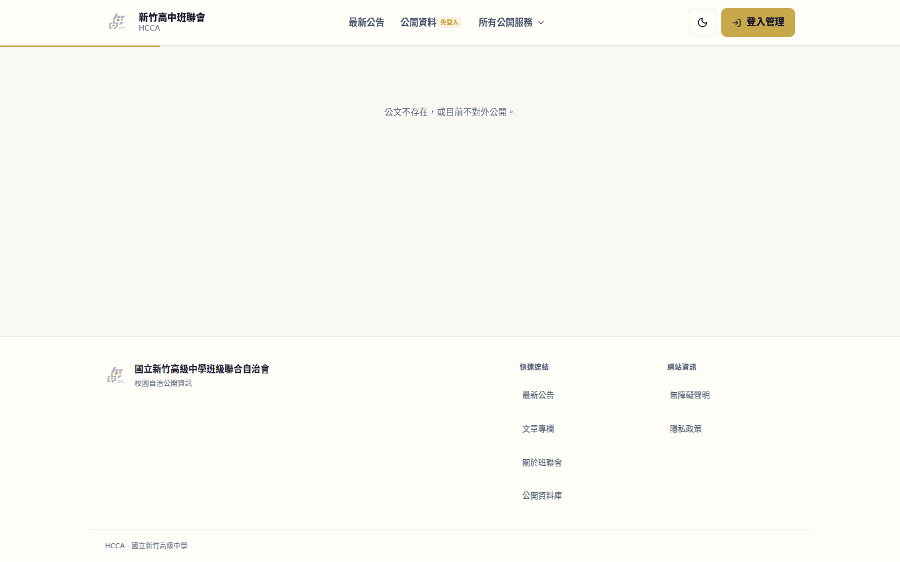
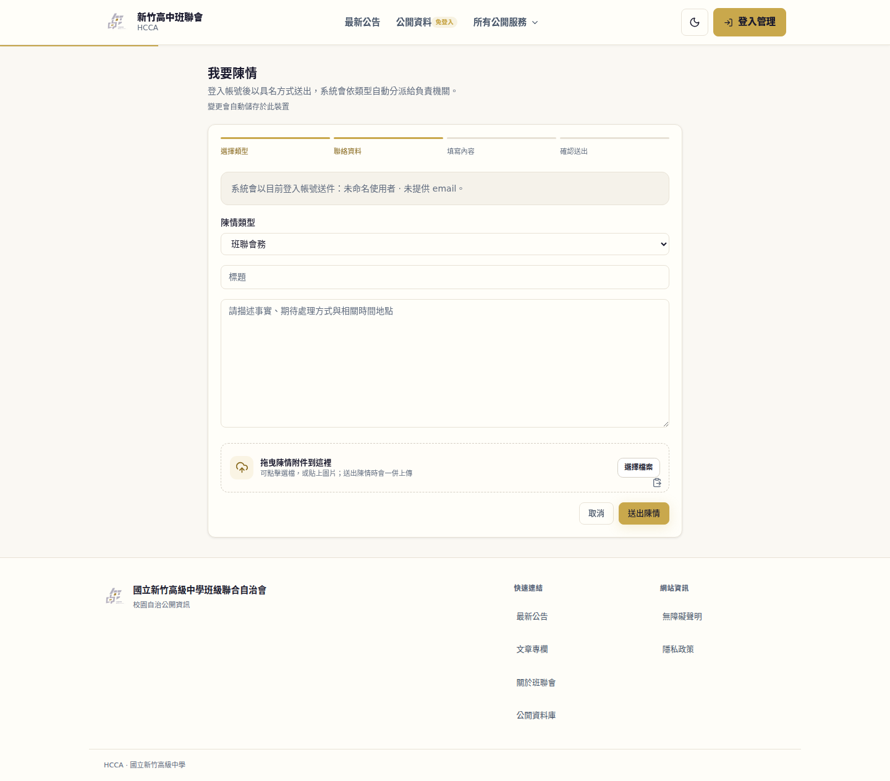
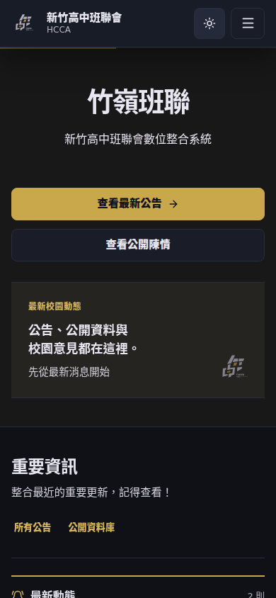

# HCCA 全站盤點：效能、安全性、操作與頁面

盤點期間：2026-09-19 至 2026-09-20（Asia/Taipei）。
正式站：https://hcca.tw 。首次讀到 API 版本 `04.12.08.67.1345`，9/20 複查為 `04.12.08.67.1352`。
程式複查基準：`b1d67a414c4c221114c496c292736edf03bdb22d`，另有使用者進行中的未提交修改。

## 結論

**這次確認 13 組問題：P0 1 組、P1 8 組、P2 4 組。優先處理資料完整性與登入身分的生命週期。**

最嚴重的問題是「搜尋使用者」會把遮蔽個資的值寫回資料庫。另有登入快照造成個人資料無法保存、MFA 狀態錯誤、撤銷失效，以及全部登出只處理 50 個工作階段等問題。這些都在真正的 SQLite `AsyncSession` 中重現，沒有使用正式帳號或改動正式資料。

正式站則確認：公開公文 API 有資料但頁面無法閱讀、未登入者可進入具名陳情表單、關閉中的問卷被顯示成沒有資料，以及可存取性問題。

| 編號 | 優先級 | 問題 | 證據 |
|---|---|---|---|
| F01 | P0 | 搜尋人員會清空持久化的 Email、學號 | 隔離資料庫重現 |
| F02 | P1 | JWT 快照是未附著的 ORM 物件，個人資料、MFA 流程失真 | 隔離資料庫重現 |
| F03 | P1 | Redis 故障或撤銷鍵消失後，已停用／撤銷的舊憑證仍通過核心驗證 | 隔離資料庫＋Redis 故障注入 |
| F04 | P1 | 全部登出只撤銷最近 50 個工作階段 | 建立 51 筆 session 重現 |
| F05 | P1 | 公開公文 API 200，但正式頁面顯示不存在 | 正式站兩日複查 |
| F06 | P1 | 分批選附件顯示累加，實際待送出清單只剩最後一批 | 真實 React 元件／JSDOM 重現 |
| F07 | P1 | 未登入者可填具名陳情，直到送出才碰到身分要求 | 正式站＋前後端流程核對 |
| F08 | P1 | 多處一般文字對比低於 WCAG AA | 正式站 axe／計算色值 |
| F09 | P1 | 上傳區包含未命名的檔案輸入與巢狀互動元件 | 正式站 axe＋元件原始碼 |
| F10 | P2 | 地圖排行按鈕小於最小目標尺寸且間距不足 | 正式站 axe 幾何量測 |
| F11 | P2 | 關閉中的問卷被顯示成「目前沒有問卷」 | 正式站 API 503 與畫面核對 |
| F12 | P2 | MFA 備用碼雜湊阻塞 async 事件迴圈 | 10ms 計時器實測延後至 375–418ms |
| F13 | P2 | 不存在的公文／法規內容仍回 HTTP 200 | 正式站錯誤路徑抽測 |

## 覆蓋範圍與證據強度

- 列冊 **180 個 `page.tsx`**：40 個管理群組、84 個保護群組、48 個公開群組、8 個未分組入口。126 個頁面入口直接使用 `use client`，36 個包含動態參數。這些是程式組織分類，不等同於實際授權結論。
- 列冊 **75 個 Router 檔案、1,104 個 GET／POST／PATCH／PUT／DELETE 路由宣告**。宣告數不等於掛載後唯一 API 數，也不代表每個端點皆經完整人工審查。首輪為 1,103 個；最終清冊包含盤點期間工作區新增的路由。
- 第一輪實際瀏覽 **41 個桌面路徑、9 個手機路徑**，另檢查 7 個內容／錯誤路徑，其中 2 個是重複複查；合計 46 個不同路徑。桌面 1440×900，手機 390×844；首頁另有 1280×720 截圖。
- 9/20 再複查公開公文、陳情表單、問卷、特約地圖與相關唯讀 API；執行手機導覽開關、Escape 與深色模式切換。
- 後端深入檢查登入、權限、session 撤銷、個人資料、MFA、檔案儲存與上傳、Webhook、共用資料庫提交；前端檢查公開資料讀取、錯誤狀態、表單、導航、快取及元件可存取性。
- **沒有正式站登入測試帳號**；保護頁面的正式站證據限於匿名導向。購票、學餐、簽核、權限角色交叉操作與訂單競態，沒有完成正式登入後端到端驗收。
- 沒有壓力測試、破壞性攻擊、正式站表單送出、正式訂單建立、第三方 OAuth 授權、資料庫 schema 修改或部署。隔離重現中的 Redis 與非必要外部副作用有測試替身，資料庫本身沒有 mock。
- 效能數字為單次瀏覽器觀測與局部量測；不是 Lighthouse 分數、CrUX p75、行動網路模擬結果或正式負載 SLO。未將未觀測到的 LCP 記錄 `0` 當作載入極快。

完整路由清冊見 [ROUTE_INVENTORY.md](ROUTE_INVENTORY.md)；9/20 可保存的重現結果見 [evidence.json](evidence.json)。9/19 全套測試與首輪瀏覽器數據以當時工具輸出為依據；跨日後原 `/tmp` 完整日誌未保留，因此不宣稱已附上全部原始日誌。

## 詳細問題

### F01 — P0：搜尋人員會修改原始個資

**位置：** `apps/api/src/api/routers/users.py:138`、`:172`；`apps/api/src/api/core/database.py:get_db`。

一般使用者走 `list_users` 的姓名查詢或 `ids` 查詢時，查出的 `User` 仍受 SQLAlchemy session 追蹤。為了隱藏敏感欄位，程式直接執行 `u.email = ""`、`u.student_id = None`，而 `get_db` 在請求成功後會 commit。

**重現：** 查詢命中一位測試使用者，`db.dirty` 有 1 筆；commit 後用新的 session 讀取，原 Email 變成空字串、學號變成 null。若同時有多位使用者被改成相同空 Email，還可能因唯一約束而使查詢失敗。

**影響：** 讀取型操作具有資料破壞副作用；可能影響登入信箱、學生身分匹配及通知。這是已重現的程式缺陷；未查詢正式資料是否已遭影響，也沒有在正式站觸發這個查詢。

**建議：** 用獨立回應 DTO 或查詢投影遮蔽欄位，避免修改 ORM instance。補上「一般權限搜尋／ID 回填後 commit，再用新 session 比對原始個資」回歸測試。修正後，授權維運人員再依稽核紀錄與備份確認是否需要修復既有資料。

### F02 — P1：登入快照不能當成可寫入的 User

**位置：** `apps/api/src/api/dependencies/auth.py:44`、`:99`；`apps/api/src/api/routers/users.py:184`；`apps/api/src/api/routers/mfa.py:108`；`apps/api/src/api/services/mfa.py:142`。

`_user_from_snapshot` 用 JWT 內容建立新的 `User(...)`，它是 transient 物件，沒有附著在目前的 DB session。下游仍把它當成已載入的 ORM 使用者，直接改欄位再 flush／commit。快照也沒有 MFA secret、pending setup、備用碼等完整欄位。

**重現：** 更新顯示名稱回傳 `Updated Name`，DB 仍是 `Audit Target`；資料庫 MFA 已啟用，狀態端點卻回 false；setup 產生 pending secret，但 commit 後 DB 沒保存。新請求重新建立快照，無法接續該 setup 狀態。

**影響：** 使用者看到成功卻未保存，無法可靠設定 MFA，既有 MFA 狀態也可能被誤報。通知偏好、主要 Email 等直接改 `current_user` 的路徑亦須逐一複查，未將未測路徑全部視為已重現。

**建議：** 明確區分不可變的驗證 principal 與持久化 User；涉及讀取敏感身分狀態或寫入時，由 service 用同一個 `AsyncSession` 載入真實 User。不要把快照直接 `add` 成新使用者。測試要經過實際含 `user` claim 的 cookie 驗證，並以新 session 查證存檔與 MFA setup→confirm。

### F03 — P1：撤銷狀態失去 Redis 證據後被放行

**位置：** `apps/api/src/api/core/security.py:212`、`:307`；`apps/api/src/api/dependencies/auth.py:77`；`apps/api/src/api/services/user_session.py:311`；`apps/api/src/api/dependencies/permissions.py:37`。

Access 驗證的 blacklist 與 session revocation 預設 fail-open，接著直接接受 JWT 的 User 快照；並未讀取持久化 session 或最新帳號狀態。Redis 若故障、撤銷寫入失敗，或復原後撤銷鍵遺失，DB 中的撤銷資料不會在這條路徑補救。

**重現：** DB 的帳號已停用、管理權限已移除、session 已撤銷；模擬 Redis 無法連線及鍵不存在兩種情況，舊 access token 均被 `_user_from_access_token` 接受，回傳的快照亦通過 `PermissionChecker('admin:all')` 的 superuser 分支。

**影響：** 既有有效憑證可能在剩餘 access 效期內繼續使用敏感能力；預設效期 15 分鐘，正式設定未讀取。這不是憑空偽造管理員 token，也不是聲稱已完成正式站 HTTP 權限突破。

**建議：** Redis 狀態無法確定時對敏感端點拒絕，或回 DB 驗證 session／帳號；同時設計撤銷版本或可重建的持久化撤銷機制，涵蓋「Redis 已恢復但鍵已消失」。只調整連線失敗時的 flag 無法處理第二種情況。

### F04 — P1：全部登出有隱藏的 50 筆上限

**位置：** `apps/api/src/api/services/user_session.py:274`、`:340`。

`revoke_all` 與 `revoke_others` 共用列表函式 `list_active`，它以 last_seen_at 排序後只取 50 筆。發行 session 的路徑沒有相同的總量上限。

**重現：** 建立 51 個有效 session，呼叫全部登出，回傳撤銷 50 筆，仍有 1 筆有效。舊 session 也不會出現在只有 50 筆的管理列表中。

**建議：** 畫面列表的分頁上限與全量撤銷分離；撤銷流程以全量查詢、分批處理或一致的使用者撤銷版本實作，並涵蓋 Redis、WebSocket 與持久化狀態。驗收 51／100 個 session、保留目前裝置、停用帳號等情境。

### F05 — P1：公開公文連結有資料卻無法閱讀

**位置：** `apps/web/src/app/(public)/documents/[id]/page.tsx:39`、`DocumentDetailEntry.tsx:23`、`PublicDocumentView.tsx:180`；`apps/web/src/lib/publicSeoFetch.ts:19`、`apps/web/src/lib/serverFetch.ts:81`。

**正式站重現：** `/documents/嶺代綜字第 1150000001 號` 是公開列表提供的連結。9/19、9/20 頁面均為 HTTP 200，卻顯示「公文不存在，或目前不對外公開」。同一瀏覽器匿名讀 `/api/documents/` 相同字號，回 HTTP 200、ID `88d2b308-465b-47c8-a9d4-2557f279ae49` 與公開公文標題。初次測試的頁面 metadata 也能取得標題。

**影響：** 學生無法閱讀列表所指向的公開公文。未推論全部公文皆受影響。

**建議：** 查核 Next server 到 API 的內部請求、字號參數與快取結果，記錄狀態碼及失敗原因。共用 fetch 目前把錯誤轉成 null，公開 view 沒有復原路徑；應分開處理 404、暫時失敗與有資料，提供重試。具體部署端根因仍待 server log 證明，不把猜測當成已定位。

### F06 — P1：分批選檔會遺漏先前附件

**位置：** `apps/web/src/components/ui/AnimatedFileUpload.tsx:205`；`apps/web/src/app/(public)/petitions/new/page.tsx:174`；另見 `apps/web/src/app/(protected)/meetings/[id]/edit/page.tsx:1028` 的相同使用模式。

元件內部以累加方式顯示檔案，`onFiles` 卻只傳本批 `accepted`；陳情表單使用 `onFiles={setFiles}`，直接覆蓋真正待送出的清單。

**元件重現：** 先選 `first.pdf`，再選 `second.pdf`，畫面有兩筆，父層只保留 `second.pdf`。再選 11 筆，設為 10 的 `maxFiles` 只限制單次操作，畫面可累積至 12 筆。此測試使用真實 React 元件及 JSDOM，沒有上傳或送出正式案件。

**建議：** 定義一致的受控清單契約，或在呼叫端累加並處理移除；上限應扣除已存在的檔案數。回歸測試比較畫面清單與提交清單，涵蓋分批加入、移除、超額、相同檔案重選。

### F07 — P1：具名陳情沒有在輸入前驗證登入

**位置：** `apps/web/src/app/(public)/petitions/new/page.tsx:37`；同目錄 `layout.tsx`；`apps/api/src/api/routers/petitions.py:437`。

匿名直接進 `/petitions/new`，表單可用且送出按鈕啟用，畫面卻顯示「系統會以目前登入帳號送件：未命名使用者 · 未提供 email」。effect 讀 localStorage 後直接設定 authReady；後端建立案件實際要求 `CurrentUser`。

**影響：** 使用者可能填完長內容才得知需要登入；姓名／Email 提示也失去可信度。未在正式站按下送出。

**建議：** 進入表單前驗證 session，提供保留返回位置的登入入口；登入成功後才建立使用者專屬草稿範圍。失效 session 要保留草稿，清楚說明需重新登入。建議 `$impeccable harden`。

### F08 — P1：系統性的文字對比不足

**位置：** `apps/web/src/app/(public)/partner-map/client.tsx:836`、`:867`、`:1037`；公開服務導覽 active link；公文、新聞、預算、選舉、洽談頁的實際 DOM。

axe 實測包含：金色 `#c9a84c` 在 `#fffef9` 底上的 11px 文字約 **2.26:1**，active 導覽約 **2.08:1**；地圖綠色 `#10b981` 一般文字約 **2.51:1**、粉色約 **3.49:1**。手機地圖亦有優惠文字與 attribution 對比問題。9/20 地圖再次回報 3 個對比節點。

**影響：** 低視力與明亮環境下閱讀困難。這些是資訊文字，不能套用純裝飾色的豁免。一般文字 AA 最低為 4.5:1，見 [WCAG 1.4.3](https://www.w3.org/WAI/WCAG22/Understanding/contrast-minimum.html)。

**建議：** 區分品牌裝飾／底色 token 與文字 token；以深色 accent-text 呈現小字，重新驗證淺色、深色、active 與 hover 狀態。建議 `$impeccable colorize`。

### F09 — P1：上傳區的鍵盤及輔助科技語意不完整

**位置：** `apps/web/src/components/ui/AnimatedFileUpload.tsx:251`、`:275`。

外層 div 是可聚焦的 `role=button`，內部又有仍可聚焦的 file input；file input 沒有 label、aria-label 或有效 aria-labelledby。正式陳情頁兩日皆可重現 axe 的 `label` 與 `nested-interactive`。

**建議：** 使用有名稱的原生 file input／對應 label，避免把可互動 input 嵌入另一個 button 語意；以鍵盤與螢幕閱讀器確認只有清楚且不重複的選檔入口。另補標題、內文的持續可見標籤，避免只靠 placeholder。建議 `$impeccable harden`。

### F10 — P2：地圖排行的點擊區太小

**位置：** `apps/web/src/app/(public)/partner-map/client.tsx:817`。

桌面版 5 個排行按鈕實測約 309×18.7px，鄰近目標安全點擊直徑約 21.4px；axe 判定尺寸與間距皆不足。這是桌面配置下的幾何問題，不宣稱手機配置的同一列表也相同。

**建議：** 至少符合 [WCAG 2.5.8 的 24×24px 或間距規則](https://www.w3.org/WAI/WCAG22/Understanding/target-size-minimum.html)，並依專案產品規範把常用觸控目標提升至 44px。建議 `$impeccable adapt`。

### F11 — P2：模組關閉被誤呈現為沒有問卷

**位置：** `apps/web/src/lib/serverFetch.ts:133`；`apps/web/src/hooks/useFetch.ts:84`；`apps/web/src/app/(public)/surveys/client.tsx:152`。

`/api/surveys/public?status=open` 明確回 503、`module_closed=true`、`mode=closed`；`/surveys` 卻顯示「目前沒有問卷／目前沒有開放填答的問卷」。模組關閉本身是設定，不是漏洞；問題是前端把這種狀態當成空資料。server fetch 回退為 []，hook 也只顯示暫時 toast，沒有可供頁面呈現的 error state。

**建議：** 保留 empty、closed、maintenance、network-error 的不同狀態，畫面顯示原因及可採取的下一步，錯誤不只停留在 toast。建議 `$impeccable harden`、`$impeccable clarify`。

### F12 — P2：MFA 雜湊阻塞同一 worker 的其他請求

**位置：** `apps/api/src/api/services/mfa.py:59`、`:68`、`:152`。

async setup 直接連續執行 8 次同步 Argon2 雜湊。9/19 局部量測花 418.1ms，10ms heartbeat 到 418.2ms 才執行；9/20 複測為 374.7／374.8ms。

**影響：** 同一事件迴圈內的其他請求暫時無法前進；硬體、併發與 worker 數會改變實際使用者延遲。這不是正式站壓力測試結果。

**建議：** 將昂貴雜湊搬到有界的 thread／worker 執行，保留 AsyncSession 的非同步 DB 路徑，避免並行雜湊耗盡記憶體。驗收關注事件迴圈 responsiveness 與同時請求，而非只看函式耗時。前端等待提示可交由 `$impeccable optimize` 一併檢視。

### F13 — P2：內容不存在時回傳成功狀態

**位置：** `apps/web/src/app/(public)/documents/[id]/page.tsx`、`PublicDocumentView.tsx:180`；`apps/web/src/app/(public)/regulations/[id]/page.tsx`。

`/documents/audit-no-such-document` 與 `/regulations/audit-no-such-regulation` 皆回 HTTP 200，但畫面最終顯示不存在；後者 API 回 404。兩頁亦未見 robots noindex。監控與搜尋引擎因此收到與內容不一致的成功訊號。

**建議：** 真正不存在時在 server 層產生適當 not-found／noindex 語意，暫時 API 故障則顯示可恢復錯誤。Next streaming 會影響最終 HTTP 狀態，驗收應同時檢查狀態、robots 與實際內容。文章路由已使用 `notFound()`，其 streaming 200 不單獨列為同一缺陷。建議 `$impeccable harden`。

## 尚待補證的觀察

- `/public/documents` 首輪出現一次 [React hydration #418](https://react.dev/errors/418)；未證明持續發生，不列入確認問題數。應比對 server／client 日期、locale、初始資料與部署版本。
- 問卷首輪 layout-shift 加總 0.668，後續複查約 0.003；不存在法規的錯誤頁曾有明顯位移。量測是簡化 observer 加總，未完整實作 CLS session-window，不作為標準 CLS 分數。建議用正式採集工具複測，參照 [CLS 定義](https://web.dev/articles/cls)。
- `serverRequest` 沒有自己的 timeout；是否導致受保護頁面長時間等待，仍需 API 延遲／斷線情境驗證。
- 陳情先建立案件再逐一上傳附件；中途失敗後重新送出可能再建新案件。尚未做交易層完整重現，建議檢查 idempotency 與部分成功後的復原流程。
- 內部 API、Webhook 出站 DNS rebinding 防護與正式 egress policy 的整合，以及部署環境是否與工作區相同，未取得基礎設施設定驗證。

## 驗證結果

| 檢查 | 結果與限制 |
|---|---|
| 前端 ESLint | 通過（9/19 當時工作區） |
| TypeScript | 通過（9/19 當時工作區） |
| Vitest | 97 項通過、0 失敗 |
| Next 正式建置 | 通過，Next.js 16.3.3／webpack |
| npm audit，正式依賴 | 已知弱點 0；不是整體安全保證 |
| Python pip-audit，已安裝環境 | 未發現已知弱點；本地 `api` 套件不在 PyPI，無法由公告庫稽核 |
| Ruff | 通過 |
| Ruff format | 561 檔通過 |
| 後端 pytest | 1,856 通過、15 失敗，達 `--maxfail=15` 停止，並非全套通過 |
| 後端失敗分類 | 13 項為刻意隔離 app DB（127.0.0.1:1）造成連線失敗；其餘 2 項是郵件品牌色與投稿掃描版本的斷言 |
| 跨日複查 | 工作區已有 `b34aac9a` 與 `110e2c3a` 修正；上述 2 個斷言測試重新執行均通過，不列為未解問題 |
| 故障注入／資料持久化 | F01–F04、F12 於 9/20 再次重現 |
| 上傳元件契約 | F06 用真實元件＋父層 state 重現 |

後端測試使用 SQLite memory 與隔離 Redis DB，未執行正式 PostgreSQL 整合驗收或 migration drift。應在有獨立 PostgreSQL 的 CI 補齊背景工作與 WebSocket 測試，不能把環境連線失敗當作 13 個產品 bug。

## 介面品質評分

這是公開頁面樣本的技術評分，不是全站合規認證，也不代表後端安全分數。

| 面向 | 0–4 分 | 依據 |
|---|---:|---|
| 可存取性 | 2 | 有 skip link、鍵盤處理，但有對比與檔案輸入語意問題 |
| 效能 | 3 | 建置通過、公開資料有快取；有重複載入／錯誤狀態位移待確認，未測負載及 INP |
| 響應式 | 3 | 390px 抽測未見文件整體橫向溢位；部分小目標仍需改善 |
| 主題 | 3 | 主題切換與手機深色外觀正常；文字 token 用法仍有對比缺口 |
| 實作一致性 | 2 | 外觀與產品導覽一致，但存在成功未存檔、附件清單不一致及錯誤被空狀態掩蓋 |
| 合計 | **13/20** | 可用，但有顯著改善項目；不適合僅依測試綠燈判定完成 |

Impeccable detector 共回報 11 個候選：9 個側邊色條、1 個 padding transition、1 個網格背景。側邊色條與背景沒有證明會妨礙任務，未作為缺陷；padding transition 也未量到實際掉幀，不列入確認問題數。**實作一致性尚未通過**，判斷依據是 F02、F05、F06、F11 的可重現行為，而不是外觀偏好。

## 已有的有效防護與良好設計

- 正式站有 CSP nonce、frame-ancestors、HSTS、nosniff 與 Referrer-Policy；一般命令列請求受到邊緣防護，正式瀏覽器可正常訪問。
- 抽測 `/api/auth/me`、`/api/admin/users` 的匿名請求為 401；管理、工作台、購票、學餐、會議等頁面會導向登入。模組關閉時的 503 不當成授權通過。
- 公開站有主要內容跳轉、手機導覽、主題切換；Modal／Drawer 原始碼有焦點限制、Escape 與焦點還原。
- 私有 server fetch 使用 no-store，公開資料獨立快取；儲存服務的檔案操作有 thread offload；Webhook URL 檢查拒絕非公開網段。
- 前後端已有大量測試與多種安全 CI；這次的缺口主要在新舊登入資料模型、跨元件契約與真實狀態切換的驗收。

## 修復順序與驗收

1. **先修 F01**：阻止讀取路徑修改資料；以 commit 後的新 session 驗證個資完全保留。
2. **共同處理 F02–F04**：界定 principal／ORM 責任，完善全量撤銷及 Redis 異常恢復；涵蓋 51 筆 session、停用、降權、MFA setup→confirm 與失效憑證。
3. **修 F05–F07**：恢復公開公文閱讀、附件清單一致性與登入後接續表單。前端狀態流程可使用 `$impeccable harden`。
4. **修 F08–F11、F13**：使用 `$impeccable colorize`、`$impeccable adapt`、`$impeccable clarify`；正式內容頁加入 axe 與錯誤狀態驗證，不能只掃首頁、法律頁。
5. **處理 F12 並量測**：在隔離環境驗證同時請求、事件迴圈延遲；公開與登入後頁面補充正式效能基線，前端使用 `$impeccable optimize`。
6. 修復後重新執行 `$impeccable audit`，最後用 `$impeccable polish` 做有界的視覺確認。可逐項或整批安排。

GitNexus 已綁定 `/home/ted98/projects/main`，索引更新至複查基準。`_user_from_snapshot` impact 為 **CRITICAL**，有 1 個直接呼叫者 `_user_from_access_token`，總計 438 個上游符號、182 個相關流程、20 個模組。`list_users` 在指定 Router 檔案後為 **UNKNOWN**，不是低風險；已以實際 decorator、依賴提交機制與資料庫重現確認可達性。上述影響數是圖譜可達範圍，不等於每個符號都已出現故障。

提交前另將索引更新至 `2d91a117`，並執行 `detect-changes --scope all --repo . --limit 1000`：共 12 個變更檔案，8 個命中符號皆屬原有工作區修改。`--scope staged` 的 6 個盤點檔案沒有命中程式符號，這是文件／截圖的預期結果，不是整個工作區沒有變更的宣告。索引器另外提示部分 execution flow 受入口、深度及分支上限省略；因此「0 個受影響流程」不能當成未提交產品修改安全的證明，此次亦不替那些修改做驗收。

本次交付為盤點文件與證據；沒有改動產品程式，也未部署。原有工作區修改未納入本次提交。

工具維護備註：Impeccable 提示 PRODUCT.md 使用舊式 Register 欄位、buildPath 尚未設定，並提示 4.3.1 更新。這些是工具上下文維護事項，未計入網站缺陷，也未在此次盤點中修改設定或升級工具。
